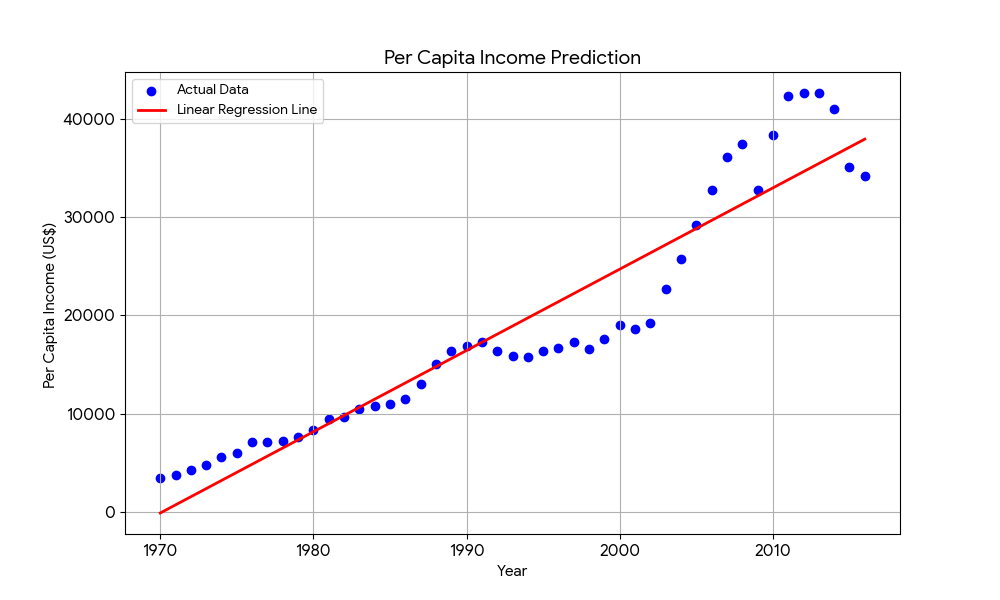

# Single Variable Linear Regression

This is my first project, where I'm learning the basics of machine learning by implementing **single-variable linear regression**.

## **Project Goal**

The main goal of this project is to:
* Understand the core concept of linear regression.
* Use the `scikit-learn` library to build a simple predictive model.
* Make predictions based on a single input feature.
* Visualize the model's performance by plotting the regression line against the data.

## **Dataset**

The dataset used is `canada_per_capita_income.csv`. It contains two columns:
* `year`: The year of the data record.
* `per capita income (US$)`: The per capita income for that year in Canada.

This dataset provides a perfect opportunity to see how a linear model can be used to predict future income based on past trends.

## **Code and Analysis**

The code is contained in the `1_SingleVariable.ipynb` Jupyter Notebook.
* I used the **year** as the independent variable (feature) and the **per capita income (US$)** as the dependent variable (target).
* The model calculated a slope of approximately **828.47**, indicating that per capita income increased by about `$828.47` each year.
* Using this model, I predicted the per capita income for the year **2024** to be **$44,602.55**.

## **Visuals**

The graph below shows the original data points and the line generated by the linear regression model.  The line visually represents the trend the model learned from the data.

## **What I've Learned**

* How to load and prepare data using **Pandas**.
* The fundamental principles of a `scikit-learn` linear regression model.
* How to interpret the **slope** and **intercept** of a linear model.
* The importance of visualizing a model's output to understand its predictions.