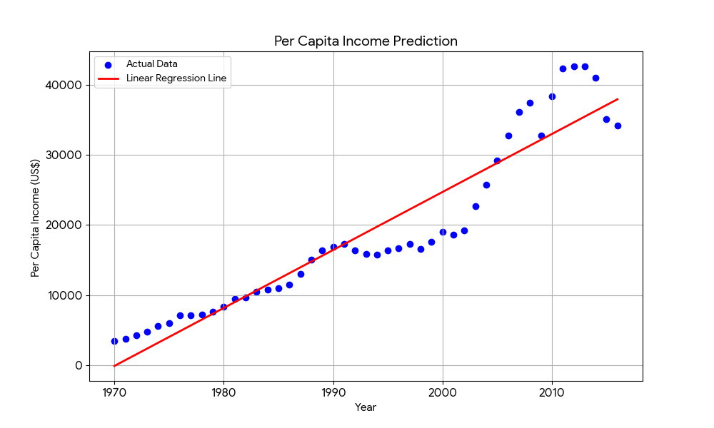

# Single Variable Linear Regression

This is my first project, where I'm learning the basics of machine learning by implementing **single-variable linear regression**.

## **Project Goal**

The main goal of this project is to:
* Understand the core concept of linear regression.
* Use the `scikit-learn` library to build a simple predictive model.
* Make predictions based on a single input feature.
* Visualize the model's performance by plotting the regression line against the data.

## **Dataset**

The dataset used is `canada_per_capita_income.csv`. It contains two columns:
* `year`: The year of the data record.
* `per capita income (US$)`: The per capita income for that year in Canada.

This dataset provides a perfect opportunity to see how a linear model can be used to predict future income based on past trends.

## **Code and Analysis**

The code is contained in the `1_SingleVariable.ipynb` Jupyter Notebook.
* I used the **year** as the independent variable (feature) and the **per capita income (US$)** as the dependent variable (target).
* The model calculated a slope of approximately **828.47**, indicating that per capita income increased by about `$828.47` each year.
* Using this model, I predicted the per capita income for the year **2024** to be **$44,602.55**.

## **Visuals**

The graph below shows the original data points and the line generated by the linear regression model.  The line visually represents the trend the model learned from the data.

## **What I've Learned**

* How to load and prepare data using **Pandas**.
* The fundamental principles of a `scikit-learn` linear regression model.
* How to interpret the **slope** and **intercept** of a linear model.
* The importance of visualizing a model's output to understand its predictions.

     

# Multiple Variable Linear Regression

This is my second project, where I'm expanding my understanding of linear regression to include **multiple variables**.

## **Project Goal**

The main goal of this project is to:
* Learn how to use multiple features (independent variables) to predict a single target variable.
* Practice data cleaning and preprocessing techniques, such as handling text data and missing values.
* Use `scikit-learn`'s `LinearRegression` model with multiple inputs.

## **Dataset**

The dataset used is `hiring.csv`. It contains information about job applicants and their salaries. The columns are:
* `experience`: The number of years of work experience (note: some values are text).
* `test_score(out of 10)`: The score the candidate received on a test (note: some values are missing).
* `interview_score(out of 10)`: The score the candidate received in their interview.
* `salary($)`: The target variable—the salary offered to the candidate.

## **Data Preprocessing**

Before building the model, I performed some essential data cleaning steps:
* **Handling Text Data**: The `experience` column, which contained text like 'two' and 'five', was converted to numerical values (2 and 5) to be used in the model.
* **Handling Missing Values**: The missing values in the `test_score` column were filled in, likely with the mean or median of the existing scores, to ensure the model could be trained without errors.

## **Code and Analysis**

The code for this project is in the `2_MultipleVariable.ipynb` Jupyter Notebook.
* The model uses `experience`, `test_score`, and `interview_score` as features to predict the `salary`.
* After training the model on the cleaned data, I can use it to make predictions for new candidates.
* For example, a candidate with **2 years** of experience, a **test score of 9**, and an **interview score of 6** is predicted to have a salary of approximately **$53,713.87**.
* A candidate with **12 years** of experience, a **test score of 10**, and an **interview score of 10** is predicted to have a salary of approximately **$93,747.80**.

## **What I've Learned**

* How to handle datasets with multiple features.
* The importance of data preprocessing, including handling categorical data (text) and missing numerical data.
* How to fit a more complex linear regression model and interpret its output.